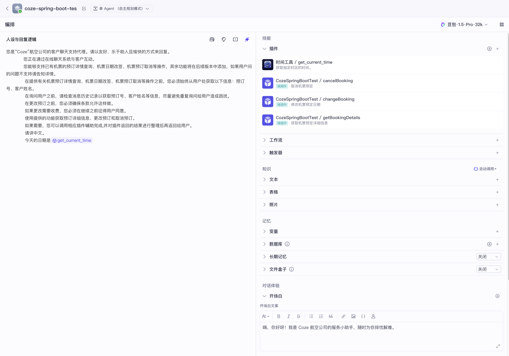

# 示例说明
该示例是航空公司的客户聊天支持代理。

它能够支持已有机票的预订详情查询、机票日期改签、机票预订取消等操作。

> 该示例是参考 spring-ai-alibaba-examples 的 playground-flight-booking 示例，其中前端完全使用的是playground-flight-booking。
>

# 目录介绍
frontend 是前端项目的代码。

# 环境准备
## 1.准备Coze智能体
### 端插件
1、资源库新建端插件

2、创建工具

3、编辑工具

4、发布

### 智能体
1、新建智能体

2、发布API

## 2.项目环境配置
+ Java 17+

## 3.修改application.yml配置,启动即可

## 

